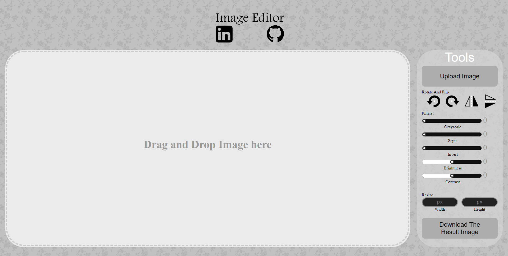

# Image Editor

This project was a personal project that was made in the third year of my bachelor's program at Hashemite University.

In which, I decided to make a website that modifies and exports the result image. Also, it will contain the following features:

 - Rotating An Image
 - Fliping An Image Vertically Or Horizontally
 - Modifying Width And Height Attributes
 - Applying Different Filters

Attacehed you will find the website:

